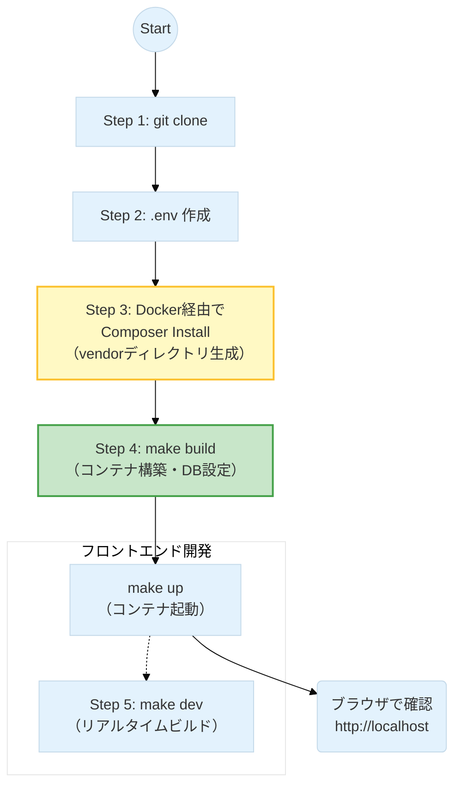

# SalsaFavor - サルサ総合ポータルサイト

## 1. 概要

サルサダンスのイベント情報、レッスン検索、関連グッズの紹介などを行う総合ポータルサイトです。
このプロジェクトは Docker と Make を利用して、簡単にローカル開発環境を構築できます。

### 技術スタック

| レイヤー         | 技術スタック                                               | 選定理由・特徴                                                                                                                          |
| ---------------- | ---------------------------------------------------------- | --------------------------------------------------------------------------------------------------------------------------------------- |
| **言語**         | **PHP 8.4**                                                | JITコンパイルの強化による高速処理と、最新の型安全性（Type Safety）を活用。                                                              |
| **FW**           | **Laravel 12**                                             | 業界標準の堅牢なフレームワーク。最新機能による開発効率の最大化。                                                                        |
| **Frontend**     | **Inertia.js / React / TypeScript / Tailwind CSS**         | Inertia.jsによるSPA体験とReact+TypeScriptの型安全・保守性、Tailwind CSSによるモバイルファーストなUI設計。SSRはLaravel Bladeで一部対応。 |
| **Database**     | **MySQL 9.2**                                              | 信頼性の高いRDBMS。イベントデータのリレーション管理。                                                                                   |
| **Cache**        | **Redis**                                                  | セッション管理、APIレスポンスのキャッシュ、およびキュー処理の高速化に使用。                                                             |
| **外部サービス** | **楽天API / Facebook API / Turnstile / ValueCommerce API** | 楽天商品検索・SNS連携・スパム防止・アフィリエイト連携など多様な外部サービスと連携。                                                     |

## 2. 必須環境

- **Docker Desktop**
- **Git**
- **Make** (Mac/Linuxは標準、WindowsはWSL2推奨)

## 3. ローカル開発環境のセットアップ手順

セットアップの全体フローは以下の通りです。特に **Step 3 (依存解決)** が重要です。



### Step 1: リポジトリのクローン

プロジェクトをローカルにダウンロードし、ディレクトリへ移動します。

```bash
git clone git@github.com:yoshis2/salsafavor.git
cd salsafavor

```

### Step 2: 環境ファイルの準備

`.env.example` をコピーして、環境設定ファイル `.env` を作成します。
このファイルには、データベース接続情報や外部APIのキーなどが設定されています。

```bash
cp .env.example .env

```

### Step 3: ライブラリのインストール (Sailの導入)

`git clone` 直後は Laravel の依存ライブラリ（vendorディレクトリ）が存在しないため、`sail` コマンドが使えません。
以下のコマンドを実行し、Docker を介して `composer install` を行います。

```bash
make sail
```

> **注意:** `.env`ファイル作成後、後述する**「🔑 外部サービスのAPI設定」**を参照して各キーを入力してください。

### Step 4: アプリケーションのビルドと起動

依存パッケージが入ったら、以下のコマンドでコンテナの構築・起動・DB設定を一括で行います。

```bash
make build
make up
```

※ このコマンドで `docker-compose up -d`、`key:generate`、`migrate`、`npm install` 等が自動実行されます。

### Step 5: フロントエンドのビルド (任意)

画面（HTML/CSS/JS）の変更をリアルタイムで反映させたい場合は、以下のコマンドを実行したままにしてください。

```bash
make dev
```

---

## 4. 動作確認

セットアップ完了後、ブラウザで以下のURLにアクセスしてください。

**http://localhost**

---

## 5. 開発に役立つ設定 (Tips)

### Sailコマンドのエイリアス設定 (Mac/Linux推奨)

`make` コマンドを使わず、直接 `sail artisan ...` などを叩きたい場合、毎回 `./vendor/bin/sail` と打つのは手間です。以下の設定をしておくと便利です。

```zsh
# zshの場合 (.zshrc に追記)
echo "alias sail='[ -f sail ] && bash sail || bash vendor/bin/sail'" >> ~/.zshrc
source ~/.zshrc
```

---

## 6. 主なMakefileコマンド

開発でよく使うコマンドは `Makefile` にまとめられています。

```bash
make help
```

**よく使うコマンド例:**

- `make up`: コンテナを起動
- `make down`: コンテナを停止
- `make in`: PHPコンテナに入る (シェル操作)

---

## 7. ドキュメント

より詳細な情報については、以下のドキュメントを参照してください。

- **[Salsafavor プロジェクト詳細仕様書](openspec/references/overview.md)**
- **[Xserver環境構築 & 【緊急時】手動デプロイガイド](openspec/references/xserver.md)**
- **[リリースタグ作成・Xserverデプロイ手順書](openspec/references/deploy.md)**
- **[DB操作ガイド (完全版)](openspec/references/migrate.md)**
- **[Docker & Docker Compose 運用コマンド集](openspec/references/docker.md)**
- **[# 📘 PHP/Laravel デバッグ完全マニュアル (図解付き・保存版)](openspec/references/debug.md)**
