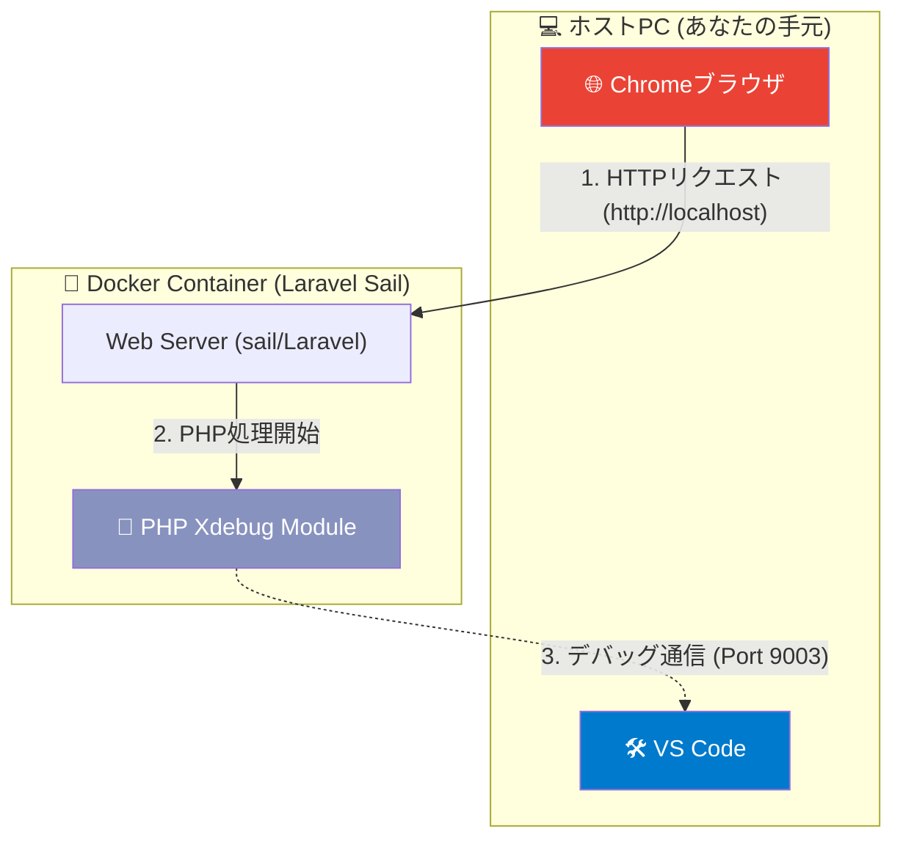
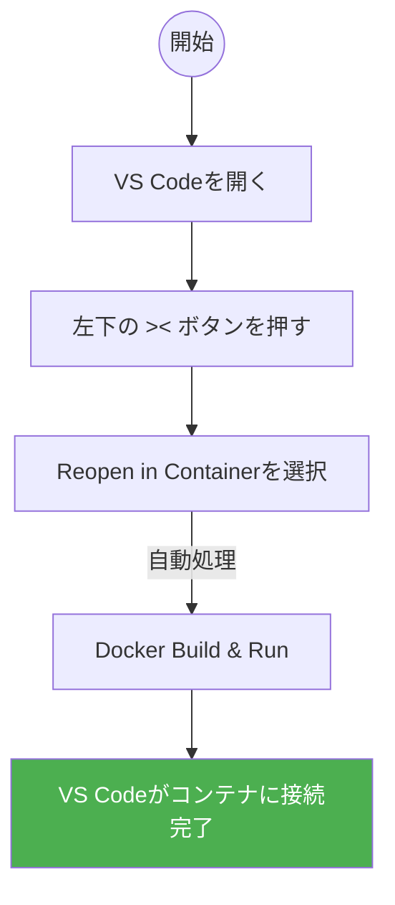
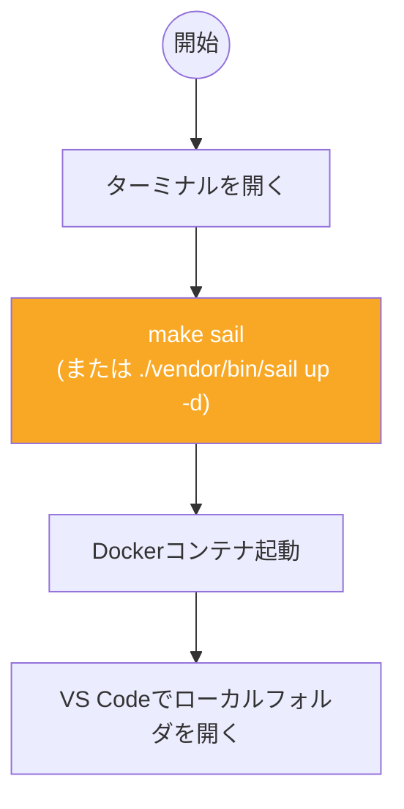
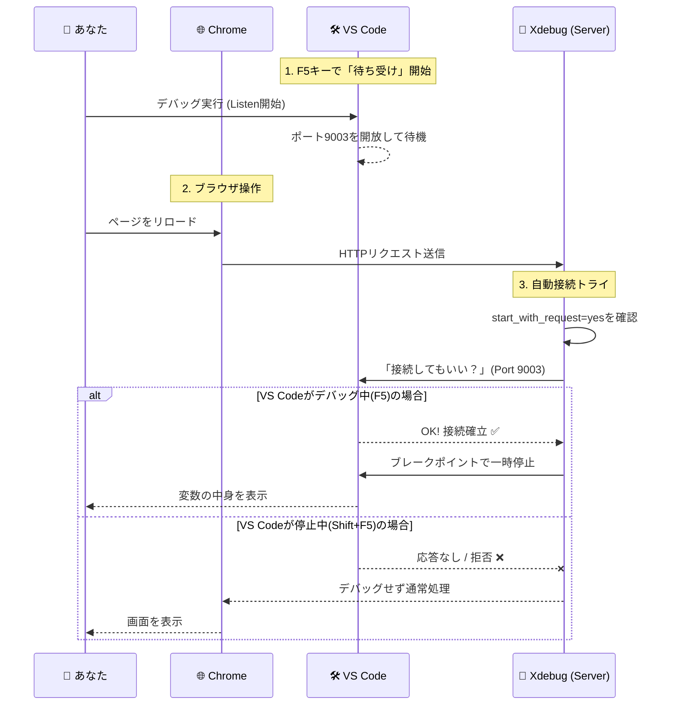

# 📘 PHP/Laravel デバッグ完全マニュアル (図解付き・保存版)

このマニュアルは、VS Codeの`launch.json`とDocker（Laravel Sail）を活用し、PHP（Xdebug）・React/TypeScript（Chromeデバッガ）両方のデバッグを快適に行うためのガイドです。

> **重要:**
>
> - **Dev Container**（VSCodeの「コンテナで開く」）では「Xdebug（PHP/Laravel）」のみデバッグ可能です。React/TypeScriptのフロントエンドデバッグは不可です。
> - **Sail（ターミナル起動）**では「Xdebug（PHP/Laravel）」と「React/TypeScript（Chromeデバッガ）」の両方が同時にデバッグ可能です。
> - `launch.json`の「Full Stack Debug」構成を使うことで、PHPとReactの同時デバッグができます。

## 0. 全体像：デバッグの仕組み

まず、私たちがこれからやろうとしていることの全体像を図で理解しましょう。
ブラウザ、コンテナ、VS Codeがどのように連携しているかを示しています。



**図の解説:**

1. ブラウザからアクセスがあると、コンテナ内のPHPが動きます。
2. PHPに組み込まれた **Xdebug** が「あ、設定でデバッグしろって言われてるな」と気づきます。
3. Xdebugからホスト側の **VS Code (ポート9003)** に向けて「今から止めてもいいですか？」と接続しに行きます。VS Codeが「待ち受け(Listen)」していれば、そこで処理が止まります。

---

## 1. 事前準備 (初回のみ)

VS Codeが Xdebug からの「電話（通信）」を受け取れるように設定します。これは起動パターンに関わらず共通で必須です。

### 📌 `launch.json` の作成

1. VS Code 左サイドバーの「実行とデバッグ」アイコンをクリック。
2. 「`launch.json` ファイルを作成します」等のリンクからファイルを作成。
3. 以下の内容を記述して保存します。

```json
{
  "version": "0.2.0",
  "configurations": [
    {
      "name": "Listen for Xdebug",
      "type": "php",
      "request": "launch",
      "port": 9003,
      "pathMappings": {
        "/var/www/html": "${workspaceFolder}"
      }
    }
  ]
}
```

> **💡 技術解説: `pathMappings` とは？**
> コンテナの中ではファイルは `/var/www/html/app/User.php` にありますが、あなたのPC（VS Code）では `/Users/name/project/app/User.php` にあります。この「場所のズレ」を修正し、コンテナ内のファイルパスをローカルのファイルパスに翻訳する役割を担っています。ここがズレていると、ブレークポイントを設定しても無視されてしまいます。

---

## 2. 環境の起動（2つのパターン）

ここが混乱しやすいポイントです。「VS Codeの中に住む（DevContainer）」か「ホストから覗く（Sail）」かでデバッグ可能範囲が異なります。

### 【パターンA】 Dev Container 機能を使う場合

VS Code自体がコンテナに接続し、コンテナ内部で開発を行うスタイルです。
**この場合、Xdebug（PHP/Laravel）のみデバッグ可能です。React/TypeScriptのデバッグは不可です。**



**手順:**

1. VS Code左下の緑色のボタン（`><`）をクリック。
2. **「コンテナーで再度開く (Reopen in Container)」** を選択。
3. Webサーバーは自動（またはターミナルが開いた後に自動）で立ち上がります。

---

### 【パターンB】 ターミナルからコマンドで起動する場合

従来通り、PCのターミナルからDockerコマンドを叩いてサーバーを起動するスタイルです。
**この場合、Xdebug（PHP/Laravel）とReact/TypeScript（Chromeデバッガ）の両方が同時にデバッグ可能です。**

#### フルスタックデバッグの流れ

1. ターミナルで `make up` → サーバー起動
2. ターミナルで `make dev` → フロントエンドのビルド&監視
3. VS Codeの「実行とデバッグ」から「Full Stack Debug (PHP + React/Typescript)」を選択し開始
4. PHPもReactもブレークポイントで止まる

> launch.jsonの「Full Stack Debug」構成は、PHP（Xdebug）とReact/TypeScript（Chromeデバッガ）を同時に起動します。



**手順:**

1. PCのターミナルを開く。
2. `make up` でサーバー起動。
3. `make dev` でフロントエンド監視。
4. VS Codeで「Full Stack Debug」を選択し開始。

---

## 3. デバッグの実行手順 (シーケンス図解)

ここからは共通の手順です。PHP/Laravel（Xdebug）もReact/TypeScript（Chromeデバッガ）も、VS Codeの「Full Stack Debug」から同時にデバッグできます。



### 実際の操作ステップ（Sail + Full Stack Debug）

1. ターミナルで `make up` → サーバー起動
2. ターミナルで `make dev` → フロントエンド監視
3. VS Code 左サイドバー「実行とデバッグ」で「Full Stack Debug (PHP + React/Typescript)」を選択し、緑色の「▷ (開始)」を押す
4. 止めたい行にブレークポイントを設置（PHPもReactもOK）
5. ブラウザで画面をリロード
6. PHPもReactも、該当箇所でVS Codeが自動で止まる

---

## 4. デバッグの停止（重要）

`start_with_request=yes` の設定は非常に便利ですが、**「常にデバッグしようとする」** という特性があります。
また、React/TypeScriptのデバッグはChromeの新しいインスタンスが自動で立ち上がり、ソースマップも自動で解決されます。

- デバッグが終わったら、必ず VS Code の停止ボタン **「□ (停止)」** (または `Shift + F5`) を押してください。
- 停止ボタンを押すことで、VS Codeはポート9003を閉じます。
- Xdebugは接続先が見つからないため、即座に諦めて通常のWeb表示処理に戻ります（これにより、ブラウザがサクサク動くようになります）。

---

## 🔍 詳細解説：なぜ「ローディング地獄」は起きるのか？

ここからは、よくあるトラブルの「根本原因」を深掘りします。これを知っておくと、トラブルシューティング力が格段に上がります。

### Xdebugの通信プロトコル (DBGP)

Xdebugは、WebサーバーからIDE（VS Code）に対して接続を行う「リバース接続」という方式をとっています。通常、私たちはブラウザ(クライアント)からサーバーへ接続しますが、デバッグ時は**サーバーがクライアントになって、エディタに接続しにくる**のです。

### タイムアウトの正体

画面が真っ白のままローディングが終わらない現象（通称：ローディング地獄）が発生するとき、裏側では以下のようなことが起きています。

1. **接続試行:** Xdebug「おーい、VS Codeさん！ユーザーがアクセスしてきたからデバッグ情報送るよ！」
2. **待機:** （シーン……応答なし）
3. **再試行:** Xdebug「おーい？ ポート9003番、開いてないの？ 忙しいの？」（ここでPHPの処理は完全にストップしています）
4. **タイムアウト:** Xdebug「ダメだ、返事がない。諦めて通常の処理を続けよう…」

この「呼びかけ〜諦める」までの時間が、初期設定だと **200ミリ秒〜数秒** かかることがあります。リクエストごとにこの待ち時間が発生するため、画面表示が極端に遅く感じたり、ブラウザがタイムアウト判定を下してしまったりするのです。

### エラーログ `ECONNREFUSED` について

ログに出ていた `connect ECONNREFUSED 127.0.0.1:9003` は、まさに上記の「呼びかけたけど、ドア（ポート）が閉まっていた（Refused）」という記録です。

- **デバッグを意図的にしていない時:** このログが出るのは正常です（無視してOK）。
- **デバッグしたい時:** このログが出るのは異常です（VS Codeが待ち受けを開始していない証拠です）。

### `composer` の警告との関連性

前回 `composer.lock` の警告が出ていましたが、これはライブラリのバージョン管理に関するもので、Xdebugの動作とは直接関係ありません。しかし、開発環境の健全性を保つためには、`make sail` などのコマンドが正常に通る状態（＝コンテナが健全な状態）にしておくことが、回り回ってデバッグ環境の安定にもつながります。

これで、ツールの使い方だけでなく、裏側の仕組みまでマスターできました。自信を持ってデバッグを進めてください！

- **[README.md](../../README.md)**
- **[Salsafavor プロジェクト詳細仕様書](overview.md)**
- **[Xserver環境構築 & 【緊急時】手動デプロイガイド](xserver.md)**
- **[リリースタグ作成・Xserverデプロイ手順書](deploy.md)**
- **[DB操作ガイド (完全版)](migrate.md)**
- **[Docker & Docker Compose 運用コマンド集](docker.md)**
