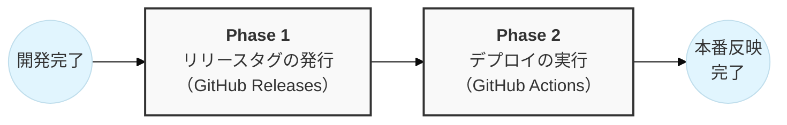
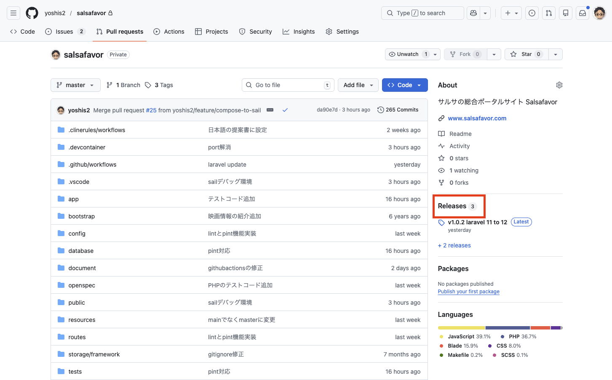
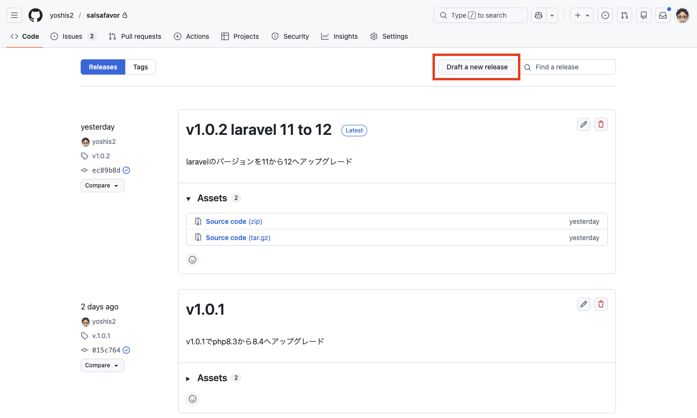
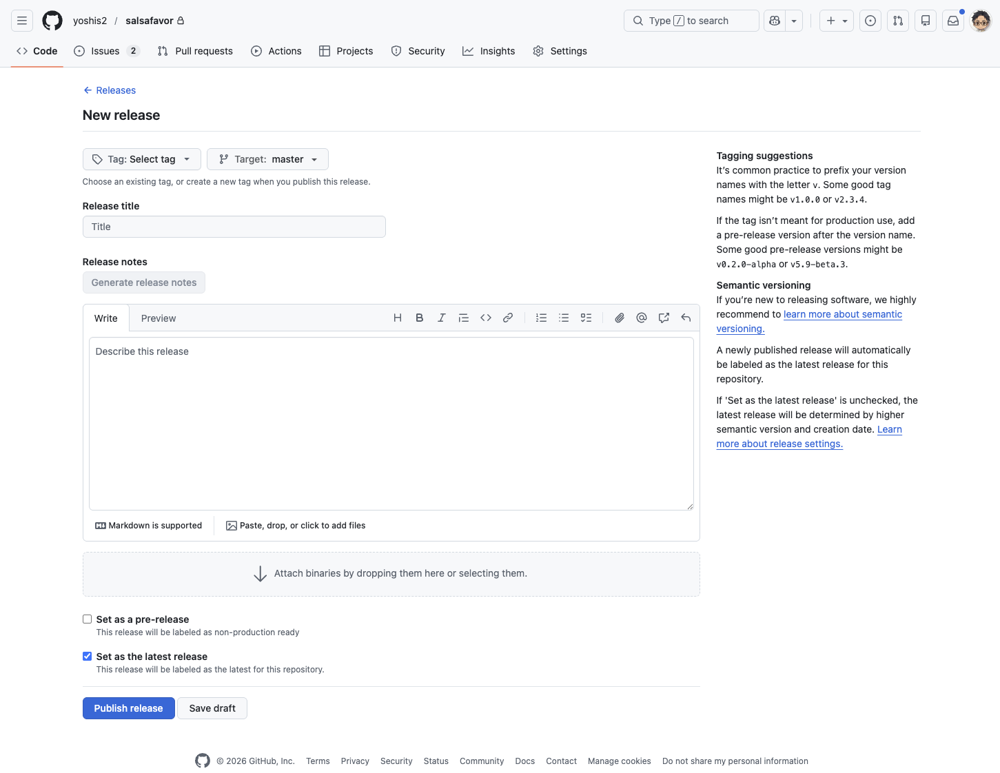
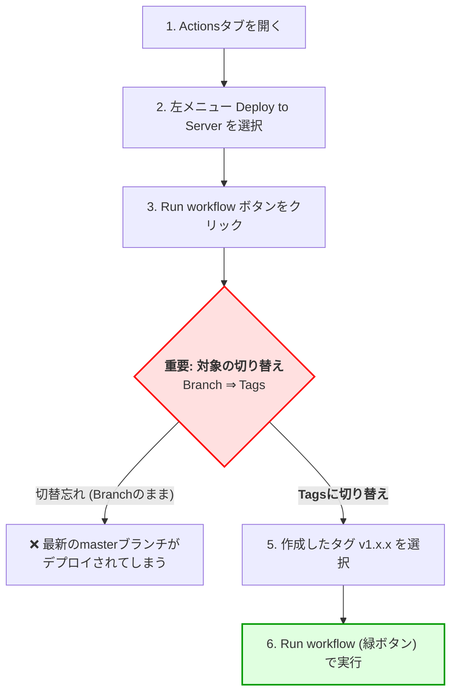
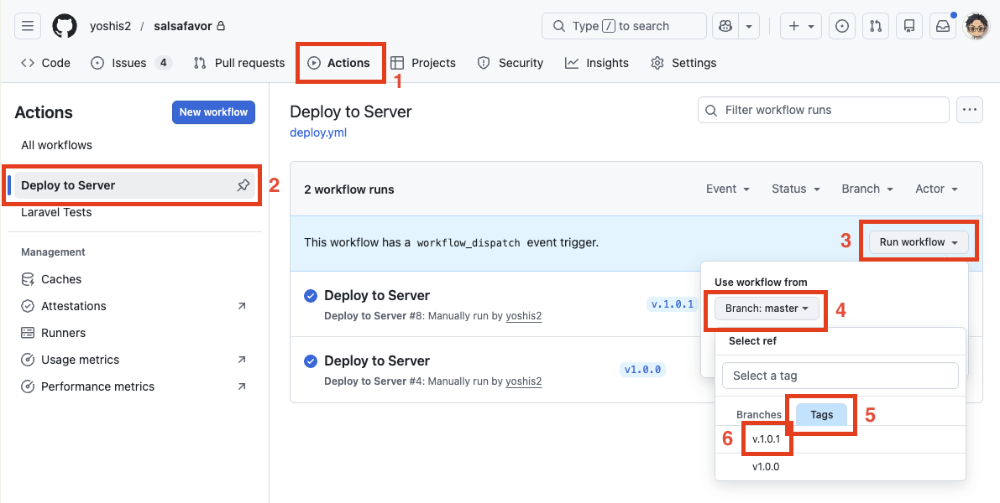
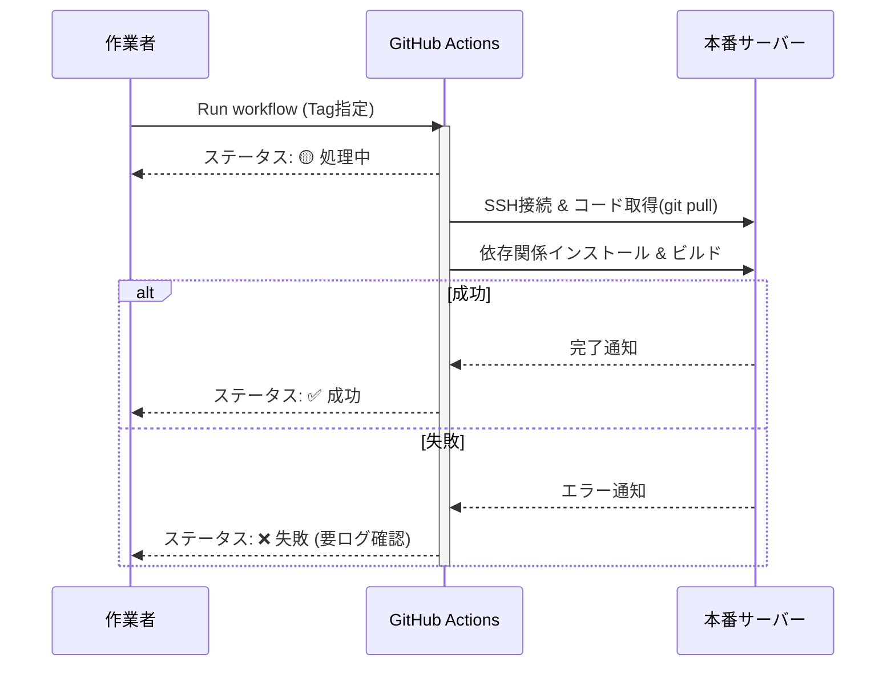

# リリースタグ作成・本番環境デプロイ手順書

本手順書では、開発済みの機能を本番環境へ反映（デプロイ）する手順を解説します。
作業プロセスは以下の通りです。



| Phase | 作業内容               | 目的                                               |
| ----- | ---------------------- | -------------------------------------------------- |
| **1** | **リリースタグの発行** | 「どのバージョンを公開するか」を確定させる（準備） |
| **2** | **デプロイの実行**     | 確定したバージョンをサーバーに反映させる（実行）   |

## Phase 1: GitHub Releasesタグの発行

まずはバージョン番号（タグ）を発行し、リリースの記録を作成します。

### 📌 操作手順

**1. Releases画面を開く**
GitHubのリポジトリトップページ右側にある **「Releases」** をクリックします。

<p align="center"></p>

**2. 新規作成画面へ移動**
Releasesページ右上の **「Draft a new release」** ボタンをクリックします。

<p align="center"></p>

**3. バージョンタグを作成する**
ここが最も重要な手順です。

1. **"Choose a tag"** をクリックし、新しいバージョン番号を入力します（例： `v1.2.3`）。
2. 入力後に表示される **「+ Create new tag: ...」** をクリックして確定します。

> **💡 バージョン番号のルール（セマンティック・バージョニング）**
> 基本的に `v` + `数字` で構成します。どの数字を上げるかは以下のフローを参考にしてください。
>
> ```mermaid
> flowchart TD
>     Start([変更内容の確認]) --> Q1{互換性のない<br>大きな変更か？}
>
>     Q1 -- Yes --> Major[<b>Major</b> を上げる<br>v1.0.0 → v2.0.0]
>     Q1 -- No --> Q2{新機能の<br>追加か？}
>
>     Q2 -- Yes --> Minor[<b>Minor</b> を上げる<br>v1.0.0 → v1.1.0]
>     Q2 -- No<br>(バグ修正等) --> Patch[<b>Patch</b> を上げる<br>v1.0.0 → v1.0.1]
>
>     style Major fill:#ffcccc,stroke:#333
>     style Minor fill:#ffffcc,stroke:#333
>     style Patch fill:#ccffcc,stroke:#333
>
> ```

**4. リリースノートを記述する**

- **Release title**: タグと同じ名前（例： `v1.2.3`）を入力します。
- **Describe this release**: 変更内容を記述します。
- _便利機能_: 右上の **「Auto-generate release notes」** ボタンを押すと、前回のリリース以降のマージ内容が自動挿入されます。

**5. リリースを公開する**
内容に間違いがないか確認し、**「Publish release」** をクリックします。
これでタグが発行され、デプロイの準備が整いました。

<p align="center"></p>

---

## Phase 2: GitHub Actions 手動デプロイ

作成したタグを指定して、本番サーバーへのデプロイを実行します。
手順の概要は以下のフローの通りです。**特に「Branch」から「Tags」への切り替え**を忘れないようにしてください。



以下の画像の番号（①〜⑥）に従って操作してください。

<p align="center"></p>

### 📌 操作手順

1. **Actionsタブを開く** (①)
   画面上部の **「Actions」** タブをクリックします。
2. **ワークフローを選択** (②)
   左メニューから **「Deploy to Server」** を選択します。
   <span style="color: red;">※ここを選択しないと実行ボタンが表示されません。</span>
3. **実行パネルを開く** (③)
   画面右側の **「Run workflow」** ボタンをクリックします。
4. **【重要】対象を「タグ」に切り替える** (④, ⑤)
   デフォルトでは「Branch: master」などが選択されています。
   **「Tags」** タブ（⑤）をクリックし、ブランチ指定からタグ指定へ切り替えてください。
5. **バージョンを指定して実行** (⑥)

- リストから、Phase 1で作成したタグ（例：`v1.2.3`）を選択します。
- 緑色の **「Run workflow」** ボタンを押してデプロイを開始します。

---

### ✅ 実行後のステータス確認

ボタンを押すと画面が更新され、一覧に新しいジョブが追加されます。

| アイコン | 状態       | 対応                                                                     |
| -------- | ---------- | ------------------------------------------------------------------------ |
| 🟡       | **処理中** | 完了まで1〜2分ほどお待ちください。                                       |
| ✅       | **成功**   | デプロイ完了です。本番環境を確認してください。                           |
| ❌       | **失敗**   | 何らかのエラーが発生しました。ログを確認し、開発担当へ連絡してください。 |



### ⚠️ 注意点

- **タグ選択ミスに注意**: 古いバージョン（v1.0.0など）を選ばないよう、必ず最新のタグか確認してください。
- **処理の待機**: 一度実行したら、完了するまでブラウザを閉じても問題ありませんが、連続して実行ボタンを押さないようにしてください。

- **[README.md](../../README.md)**
- **[Salsafavor プロジェクト詳細仕様書](overview.md)**
- **[Xserver環境構築 & 【緊急時】手動デプロイガイド](xserver.md)**
- **[DB操作ガイド (完全版)](migrate.md)**
- **[Docker & Docker Compose 運用コマンド集](docker.md)**
- **[📘 PHP/Laravel デバッグ完全マニュアル (図解付き・保存版)](debug.md)**
