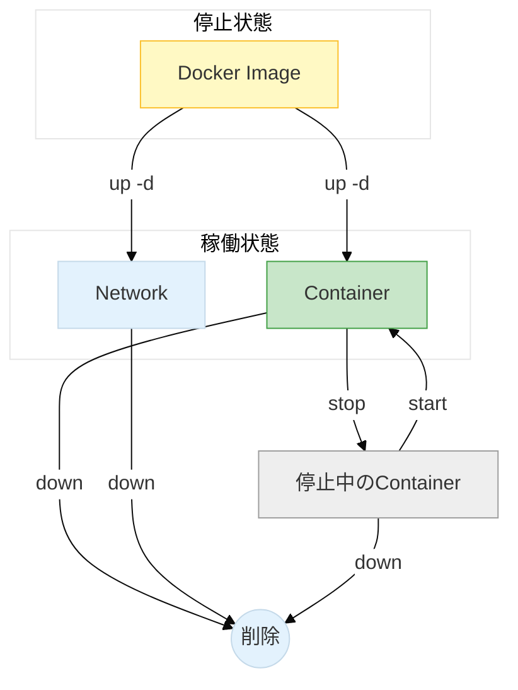
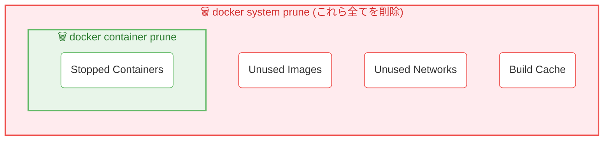

# 【最新版】Docker & Docker Compose 運用コマンド集

現在は **Docker Compose V2** が標準です。
基本コマンドは `docker-compose` ではなく **`docker compose`**（スペース区切り）を使用するのが推奨されています。

## 1. 起動と停止（ライフサイクル）

日常的な開発で最も頻繁に使うコマンドです。
`up` と `down` が対になって環境を作ったり壊したりする流れを理解しましょう。



### コンテナを起動（バックグラウンド）

```bash
docker compose up -d
```

- **解説**: 設定ファイル(`compose.yaml`や`docker-compose.yml`)に基づいてコンテナを作成・起動します。
- **オプション**:
- `-d`: バックグラウンドで実行（デタッチモード）。ログが画面を占領しません。
- `--build`: イメージを再ビルドしてから起動します（Dockerfileを修正した時に必須）。

### コンテナを停止・削除（推奨される終了方法）

```bash
docker compose down
```

- **解説**: `up` で作成されたコンテナ、ネットワークを**まとめて停止・削除**します。
- **なぜこれを使う？**: 単なる停止(`stop`)ではなく、環境を綺麗に片付けるため、次回起動時のトラブルが減ります。

### コンテナを停止・削除し、ボリュームも消す（完全リセット）

```bash
docker compose down --volumes
```

- **解説**: データベースの中身（永続化データ）まで完全に消し去りたいときに使います。

---

## 2. 状態確認とログ

### ログを見る（リアルタイム監視）

```bash
docker compose logs -f
```

- **解説**: 全コンテナのログを流し見します。`Ctrl + C` で抜けます。
- **特定のみ**: `docker compose logs -f app` のようにサービス名を指定すると見やすくなります。

### 稼働状況の確認

```bash
docker compose ps
```

- **解説**: 現在のプロジェクトで動いているコンテナの一覧を表示します。`docker ps` よりもプロジェクト単位で見れるため見やすいです。

---

## 3. コンテナ内の操作

### 起動中のコンテナに入る

```bash
docker compose exec [サービス名] bash
```

- **例**: `docker compose exec app bash` （phpやnodeコンテナに入ってコマンドを叩く時など）
- **解説**: 既に動いているコンテナの中にログインします。Alpine Linuxベースの場合は `bash` ではなく `sh` を使ってください。

---

## 4. お掃除・削除（モダンな方法）

ご提示いただいた `docker rm `...`` は古い方法です。現在は以下のコマンドを使います。
「どのコマンドで何が消えるか」の包含関係は以下の図の通りです。



### 重複・不要なコンテナを一掃する

```bash
docker compose up -d --remove-orphans
```

- **解説**: `compose.yml` に定義されていない「迷子コンテナ（orphans）」が残っている場合、それらを削除してから起動します。構成を変更した際に役立ちます。

### 停止している全コンテナを削除（全プロジェクト対象）

```bash
docker container prune
```

- **解説**: 停止中（Exited）のコンテナを全て削除します。「Yes/No」を聞かれるので安心です。

### 【強力】未使用の全リソース（イメージ、コンテナ、ネットワーク）を削除

```bash
docker system prune
```

- **解説**: 使っていないキャッシュや古いイメージを一括削除し、ディスク容量を空けます。
- **注意**: 必要なビルドキャッシュも消えるため、次回のビルド時間が長くなる可能性があります。

---

## 5. コマンド対照表（新旧比較）

よく使うコマンドの新旧対応表です。

| 目的        | 旧コマンド (非推奨)         | **新コマンド (推奨)**        |
| ----------- | --------------------------- | ---------------------------- |
| 起動        | `docker-compose up -d`      | **`docker compose up -d`**   |
| 全削除      | `docker rm `docker ps -aq`` | **`docker container prune`** |
| 全停止&削除 | `docker-compose down`       | **`docker compose down`**    |
| ログ        | `docker-compose logs -f`    | **`docker compose logs -f`** |
| ビルド      | `docker-compose build`      | **`docker compose build`**   |

### 💡 おすすめの運用

毎回 `docker compose` と打つのは長いため、エイリアス（短縮コマンド）を設定すると開発が爆速になります。

**Mac/Linux (.zshrc 等) への設定例:**

```bash
alias d='docker compose'
alias dup='docker compose up -d'
alias ddown='docker compose down'
alias dlogs='docker compose logs -f'
```

これで `dup` だけで起動できるようになります。

- **[README.md](../../README.md)**
- **[Salsafavor プロジェクト詳細仕様書](overview.md)**
- **[Xserver環境構築 & 【緊急時】手動デプロイガイド](xserver.md)**
- **[リリースタグ作成・Xserverデプロイ手順書](deploy.md)**
- **[DB操作ガイド (完全版)](migrate.md)**
- **[📘 PHP/Laravel デバッグ完全マニュアル (図解付き・保存版)](debug.md)**
