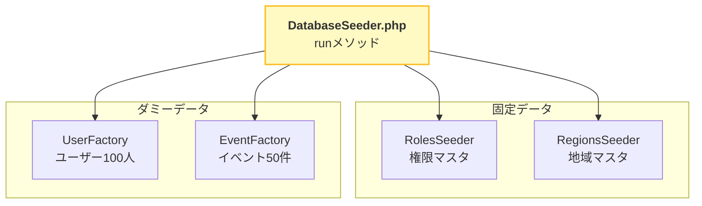
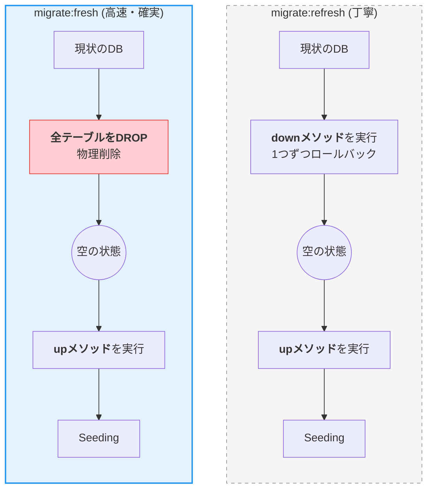

# 📘 DB操作ガイド (完全版)

`php artisan` (Sail環境では `sail artisan`) を使用したデータベース操作の解説です。

## 1. 既存リストの詳しい解説

ご提示いただいたコマンドが「具体的に何をしているのか」の補足です。

### マイグレーション (Migration)

マイグレーションは「前進（適用）」と「後退（取り消し）」が可能なバージョン管理システムです。


**マイグレーションファイルの作成**

```shell
# 新規テーブル作成（ファイル名にタイムスタンプが付き、up/downメソッドが生成される）
sail artisan make:migration create_roles_table --create=roles

# 既存テーブル修正（カラム追加・変更用の空のファイルが生成される）
sail artisan make:migration add_users_add_withdrawal --table=users

```

**マイグレーションの実行**

```shell
# まだ実行されていない（未適用の）マイグレーションファイルを検出し、実行します。
sail artisan migrate

```

**マイグレーションのロールバック**

```shell
# "直前の1回分" の操作を取り消します。
# 間違えてmigrateしてしまった直後に使います。
sail artisan migrate:rollback

```

### シーディング (Seeding)

データの投入フローは以下の通りです。`DatabaseSeeder` が司令塔となり、個別のSeederやFactoryを呼び出します。



**Seedファイルの作成**

```shell
# database/seeders フォルダにファイルが作られます。
sail artisan make:seeder RegionsSeeder

```

**Seedの実行**

```shell
# オートロードの再構成（クラスが見つからないエラーが出た時に実行）
sail composer dump-autoload
# ※ docker-compose exec ... と書くより sail composer ... の方が短くて済みます

# DatabaseSeeder.php の run() メソッドを実行（全体実行）
sail artisan db:seed

# 特定のシーダークラスだけをピンポイントで実行
sail artisan db:seed --class=RegionsSeeder

```

**【重要】全データ入れ替え (Refresh)**

```shell
# 全てのテーブルを「ロールバック(down実行)」してから、「再度マイグレーション(up実行)」し、最後に「シーディング」します。
# "downメソッドが正しく書かれているか" のテストにもなります。
sail artisan migrate:refresh --seed

```

---

## 2. 追記すべき「超重要」コマンド

マニュアルに書き足しておくべき、現場で必須のコマンドです。

### ① 全データ消去＆再構築 (Fresh)

`refresh` と似ていますが、プロセスが異なります。開発中は `fresh` が推奨されます。



```shell
# 全テーブルを「ドロップ(物理削除)」して、マイグレーションを一から作り直します。
# ロールバック処理(down)を行わないため、ゴミが残らずきれいに再構築できます。
sail artisan migrate:fresh --seed

```

> **使い分け:**
>
> - `refresh`: ロールバック処理もテストしたい時。丁寧だが遅い。
> - `fresh`: とにかく手っ取り早くDBを初期状態に戻したい時。**開発中はこちらが推奨。**

### ② マイグレーションのステータス確認

「どのファイルまで適用されたっけ？」「このファイルは実行済み？」と迷った時に使います。

```shell
# 適用済み(Ran)か、未適用(Pending)かを一覧表示します。
sail artisan migrate:status

```

### ③ ステップ数を指定してロールバック

「直前の1回」ではなく、「3回前まで戻りたい」という場合に使います。

```shell
# 直近の3回分のマイグレーションを取り消す
sail artisan migrate:rollback --step=3

```

### ④ 強制実行 (Production用)

本番環境では、データ消失事故を防ぐためにマイグレーションコマンドは確認を求められます。自動デプロイなどで確認をスキップする場合に使います。

```shell
# 確認プロンプトを出さずに強制実行
sail artisan migrate --force

```

### ⑤ ファクトリの作成 (Factory)

シーダーは「固定データ（都道府県など）」を入れるのに対し、ファクトリは「テスト用のダミーデータ（架空のユーザー100人など）」を大量生成するために使います。

```shell
# Userモデル用のファクトリを作成
sail artisan make:factory UserFactory --model=User

```

---

## 3. おすすめのドキュメント構成案

上記を踏まえ、マニュアルを更新するなら以下のような構成にすると、チームメンバーが迷わなくなります。

```markdown
# DB操作コマンド集

## よく使うコマンド（開発リセット用）

まずはこれだけ覚えればOK。DBを完全にリセットして初期データを入れ直します。
sail artisan migrate:fresh --seed

## マイグレーション (構造変更)

- 作成 (新規): `sail artisan make:migration create_〇〇_table --create=〇〇`
- 作成 (修正): `sail artisan make:migration add_〇〇_to_〇〇_table --table=〇〇`
- 実行: `sail artisan migrate`
- 確認: `sail artisan migrate:status`
- 取消 (1つ戻る): `sail artisan migrate:rollback`

## シーディング (データ投入)

- 作成: `sail artisan make:seeder 〇〇Seeder`
- 実行 (個別): `sail artisan db:seed --class=〇〇Seeder`
- クラス認識エラー時: `sail composer dump-autoload`

## トラブルシューティング

- **migrate:refresh** と **migrate:fresh** の違い
  - `refresh`: downメソッドを実行して戻す（ロールバックのテスト用）
  - `fresh`: テーブルを全削除して作り直す（開発中のリセット用・推奨）
```

このように `fresh` コマンドを追加し、開発中のリセット手段として推奨しておくことを強くおすすめします。

- **[README.md](../../README.md)**
- **[Salsafavor プロジェクト詳細仕様書](overview.md)**
- **[Xserver環境構築 & 【緊急時】手動デプロイガイド](xserver.md)**
- **[リリースタグ作成・Xserverデプロイ手順書](deploy.md)**
- **[Docker & Docker Compose 運用コマンド集](docker.md)**
- **[📘 PHP/Laravel デバッグ完全マニュアル (図解付き・保存版)](debug.md)**
