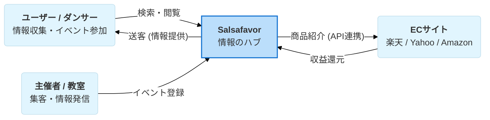
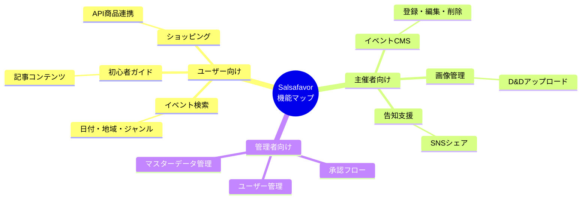
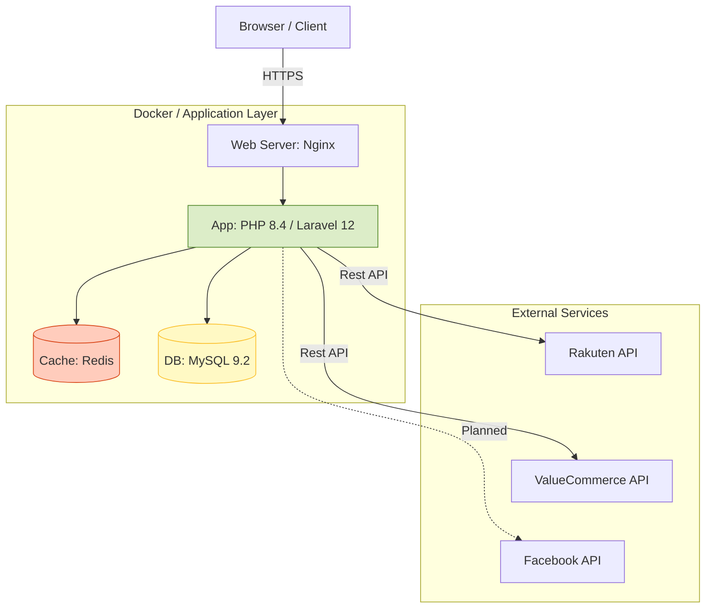
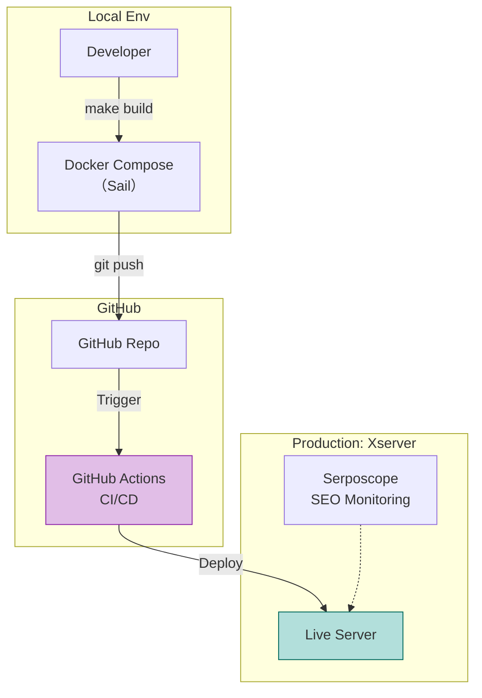
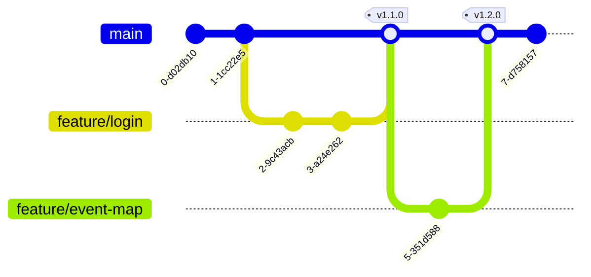
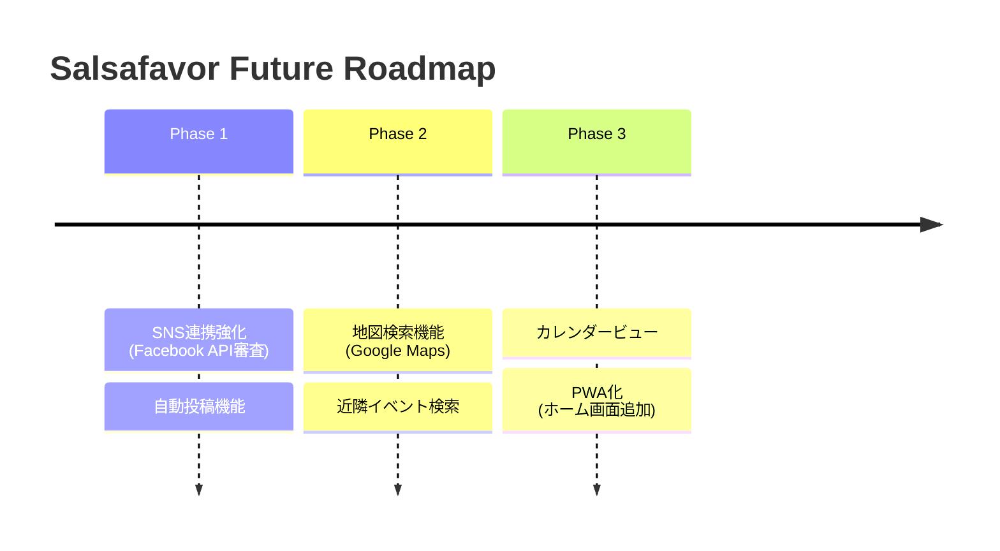

# Salsafavor プロジェクト詳細仕様書

## 1. プロジェクトの理念と戦略 (Vision & Strategy)

### ミッション

**「日本のサルサシーンを繋ぐ、情報のハブになる」**
FacebookなどのSNSに散在し、フロー情報として流れてしまいがちな「イベント」や「レッスン」の情報をストック情報として蓄積・整理し、検索可能にすることで、既存ダンサーの利便性向上と、新規層の参入障壁を下げることを目的としています。

### ビジネスモデル

1. **アフィリエイト収益**: 楽天API/Yahoo APIを活用し、サルサ関連グッズ（ニッチ商材）を提案・販売することで収益を得る。
2. **プラットフォーム価値**: オーガナイザー（主催者）が自らイベントを告知できる「場」を提供し、UGC（User Generated Content）によってサイトのコンテンツが自動的に増える仕組みを目指す。

---

## 2. 機能詳細とユーザー体験 (Functional Specification)

機能構成の全体マップです。

### A. 一般ユーザー向け機能（閲覧・検索）

- **多角的イベント検索**:
- 日付、地域、ジャンル（On1/On2/Cuban/Bachata等）による絞り込み検索。
- SNSでは埋もれがちな「今週末どこで踊れる？」というニーズに即座に応えるUI。
- **初心者導入ガイド (Onboarding)**:
- 「サルサとは？」から始まり、スタジオの選び方、服装、マナーまでを網羅した記事コンテンツ群。SEOの流入元（ランディングページ）としての役割も担う。
- **統合ショッピングモール**:
- ダンスシューズや衣装など、一般店舗では手に入りにくい商品をAPI連携で自動収集・表示。ユーザーは複数のECサイトを横断せずに商品を比較可能。

### B. オーガナイザー（主催者）向け機能

- **イベントCMS (コンテンツ管理)**:
- 専用の管理画面から、自身のイベントやレッスンスケジュールを登録・編集・削除（CRUD）が可能。
- **画像管理**:
- フライヤー（チラシ）画像やスタジオの写真をアップロードし、ドラッグ＆ドロップで並び替えが可能。
- **告知支援 (Planned)**:
- Facebookシェア機能など、登録した情報を外部SNSへ拡散するための支援ツール。

### C. 管理者 (Admin) 機能

- **コンテンツ承認フロー**: ユーザーが投稿したイベントの公開/非公開制御。
- **ユーザー管理**: 不正ユーザーの排除や、オーガナイザー権限の付与。
- **マスターデータ管理**: 地域、ジャンルなどのマスタ管理。

---

## 3. 技術アーキテクチャ詳細 (Technical Architecture)

最新のモダンPHP環境を採用し、長期的な保守性とパフォーマンスを重視した構成です。

---

## 4. インフラとDevOps (Infrastructure & DevOps)

ローカル開発の柔軟性と、本番運用の安定性・コストパフォーマンスを両立させた構成です。

### 開発環境 (Local)

- **Docker & Docker Compose**:
- `web` (Nginx), `app` (PHP-FPM), `db` (MySQL), `redis`, `mailpit` (メールテスト) をコンテナ化。
- `Laravel Sail` をベースにカスタマイズし、チーム開発（将来的な拡張）においても `make build` 一発で環境が立ち上がる再現性を確保。

### 本番環境 (Production)

- **Xserver (レンタルサーバー)**:
- **理由**: コストパフォーマンスが高く、PHP/MySQLの安定動作に定評がある。
- **デプロイ**: GitHub Actionsを活用したCI/CDパイプラインを構築（または計画）。Git経由でのデプロイ、もしくはSSHでのアーティファクト転送により、FTP手動アップロードの事故を防ぐ。

### 監視・分析 (Monitoring & SEO)

- **Serposcope**:
- Dockerコンテナ等で運用し、「サルサ レッスン 東京」などのキーワード順位を毎日自動計測。SEO施策の効果測定を行う。
- **Log Management**:
- LaravelのログおよびWebサーバーログによるエラートラッキング。

---

## 5. ディレクトリ/リポジトリ構成

- **リポジトリ**: `github.com:yoshis2/salsafavor`

**ブランチ戦略 (Git Flow Simplified):**

- **ブランチ戦略**:
- `main`: 本番反映用（常にデプロイ可能な状態）。
- `feature/xxx`: 機能追加ごとのトピックブランチ。

---

## 6. 今後のロードマップ (Future Roadmap)

現在の基盤（PHP 8.4 / Laravel 12）は非常にモダンであるため、以下の機能拡張がスムーズに行えます。

1. **SNS連携強化**: Facebook APIの審査通過を目指し、自動投稿機能の実装。
2. **地図検索機能**: Google Maps APIと連携し、「現在地周辺の今夜のイベント」を地図上にピン留め表示。
3. **カレンダービュー**: リスト表示だけでなく、月間カレンダー形式でのイベント表示。
4. **PWA化**: モバイルアプリのようにホーム画面に追加できる機能の実装。

---

この詳細版をドキュメントのトップ（`README.md` の補足や `openspec/references/overview.md`）として配置すると、開発メンバーや協力者に対して非常に分かりやすい説明となります。

- **[README.md](../../README.md)**
- **[Xserver環境構築 & 【緊急時】手動デプロイガイド](xserver.md)**
- **[リリースタグ作成・Xserverデプロイ手順書](deploy.md)**
- **[DB操作ガイド (完全版)](migrate.md)**
- **[Docker & Docker Compose 運用コマンド集](docker.md)**
- **[📘 PHP/Laravel デバッグ完全マニュアル (図解付き・保存版)](debug.md)**
