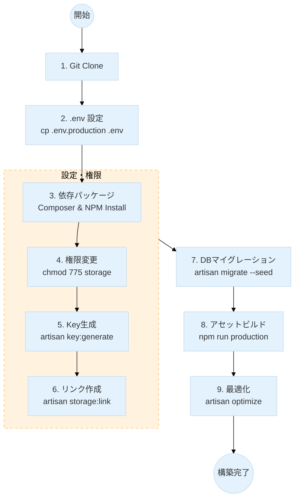
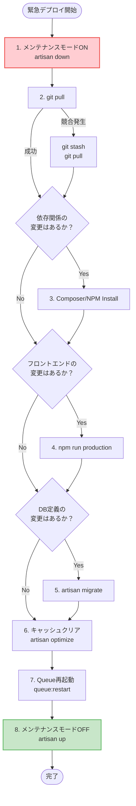

# Xserver環境構築 & 【緊急時】手動デプロイガイド

このドキュメントは、Xserver上でのアプリケーション構築手順と、**自動デプロイが機能しない場合の緊急対応**についてまとめたものです。

### 1. 前提条件

XserverのCLI（SSH）環境では、デフォルトの `php` コマンドが古いバージョンの場合があります。必ずフルパスでバージョンを指定して実行します。

- **PHPの実行パス**: 本プロジェクトでは `php8.4` を使用します。

```bash
# バージョン確認
/usr/bin/php8.4 -v
```

- **Composerのパス**: Xserver上にインストールしたComposerをPHP 8.4で動かすため、以下のように指定します。

```bash
# Composerの実行例
/usr/bin/php8.4 ~/bin/composer install
```

---

### 2. 初回構築手順（標準セットアップ）

サーバーに初めてアプリケーションを設置する場合の**標準的な手順**です。
※この手順は、サーバー移行時や新規構築時に一度だけ実行します。



1. **リポジトリのクローン**

```bash
git clone [リポジトリURL] [ディレクトリ名]
cd [ディレクトリ名]
```

2. **環境ファイル `.env` の設定**

```bash
cp .env.production .env
vi .env # データベース情報などを編集
```

3. **依存パッケージのインストール**

```bash
/usr/bin/php8.4 ~/bin/composer install --no-dev
npm install
```

4. **ディレクトリ権限の変更 (Xserver必須)**
   Xserverでは書き込み権限がないとエラーになるため、storage等の権限を変更します。

```bash
chmod -R 775 storage bootstrap/cache
```

5. **アプリケーションキーの生成**

```bash
/usr/bin/php8.4 artisan key:generate
```

6. **ストレージへのシンボリックリンク作成**

```bash
/usr/bin/php8.4 artisan storage:link
```

7. **データベースのマイグレーション**

```bash
/usr/bin/php8.4 artisan migrate --seed --force
```

8. **フロントエンドアセットのビルド**

```bash
npm run production
```

9. **アプリケーションの最適化**

```bash
/usr/bin/php8.4 artisan optimize
```

---

### 3. 【緊急時・例外対応】コード更新時の手動デプロイ

> **🛑 警告: 通常はこの手順を行わないでください**
> 本プロジェクトの正規の運用フローは **GitHub Actions による自動デプロイ** です。
> 通常のデプロイ手順については、別途 **[`deploy.md`](https://www.google.com/search?q=./deploy.md)** を参照してください。
> ここに記載されている「手動でのコード更新」は、以下の**緊急事態においてのみ**実行してください。
>
> - **GitHub Actions が障害で停止している場合**
> - **自動デプロイ設定が完了する前の一時的な対応**
> - **本番サーバー内でのみ発生する致命的な不具合の調査**

やむを得ず手動でコードを更新する場合は、安全のため**メンテナンスモード**に入れてから作業することを強く推奨します。

#### 緊急デプロイフロー



1. **メンテナンスモードへ移行 (推奨)**
   作業中にアクセスしたユーザーに503エラー画面を表示し、予期せぬ挙動を防ぎます。

```bash
/usr/bin/php8.4 artisan down --render="errors::503" --secret="<your-secret-key>"
```

2. **Git Pull (コードの取得)**

```bash
git pull
```

> **トラブルシューティング:**
> `git pull` 時に `error: cannot pull with rebase: You have unstaged changes.` が出た場合（サーバー上のファイルが書き換わっている場合）、一時的に変更を退避させます。
>
> ```bash
> git stash       # 変更を一時退避
> git pull        # pull実行
> # git stash pop # 必要であれば退避した変更を戻す（通常は不要）
>
> ```

3. **(必要に応じて) 依存パッケージの更新**

`composer.json` や `package.json` に変更があった場合のみ実行します。

```bash
/usr/bin/php8.4 ~/bin/composer install --no-dev --optimize-autoloader
npm install
```

4. **フロントエンドアセットの再ビルド**

`resources` 以下の `js`, `css` 等に変更があった場合は必須です。

```bash
npm run production
```

5. **(必要に応じて) データベースマイグレーション**

```bash
/usr/bin/php8.4 artisan migrate --force
```

6. **キャッシュのクリアと再最適化 (重要)**
   古い設定が残るとエラーの原因になるため、必ずリフレッシュします。

```bash
# 設定・ルート・ビューのキャッシュを全て作り直す
/usr/bin/php8.4 artisan optimize

# イベントや他のキャッシュも念の為クリア
/usr/bin/php8.4 artisan event:cache
/usr/bin/php8.4 artisan view:cache
```

7. **キューの再起動 (重要)**
   ジョブキューワーカーを動かしている場合、再起動しないと古いコードで動き続けてしまいます。

```bash
/usr/bin/php8.4 artisan queue:restart
```

8. **メンテナンスモードの解除**

```bash
/usr/bin/php8.4 artisan up
```

---

### 4. トラブルシューティング・コマンドリファレンス

デプロイ後に不具合が起きた場合の対処コマンドです。

**キャッシュがおかしい時の強力なクリア**
`php artisan optimize` だけで直らない場合、個別にクリア・再構築します。

```bash
# 全キャッシュのクリア
/usr/bin/php8.4 artisan optimize:clear

# 個別クリア（詳細対応用）
/usr/bin/php8.4 artisan cache:clear
/usr/bin/php8.4 artisan config:clear
/usr/bin/php8.4 artisan route:clear
/usr/bin/php8.4 artisan view:clear

# クラスのオートロード再生成（クラスが見つからないエラー時）
/usr/bin/php8.4 ~/bin/composer dump-autoload
```

**ログの確認**
エラー原因の特定にはLaravelのログを確認します。

```bash
tail -f storage/logs/laravel.log
```

**Laravelバージョン確認**

```bash
/usr/bin/php8.4 artisan -V
```

- **[README.md](../../README.md)**
- **[Salsafavor プロジェクト詳細仕様書](overview.md)**
- **[リリースタグ作成・Xserverデプロイ手順書](deploy.md)**
- **[DB操作ガイド (完全版)](migrate.md)**
- **[Docker & Docker Compose 運用コマンド集](docker.md)**
- **[📘 PHP/Laravel デバッグ完全マニュアル (図解付き・保存版)](debug.md)**
